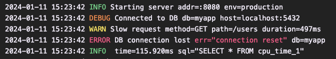

# `tint`: 🌈 **slog.Handler** that writes tinted logs


实现了一个 [slog.Handler]，可以写入着色（colorized）的日志。
可以通过 [Config] 自定义输出格式，它是[slog.HandlerOptions]的直接替代品。

# 定制属性

可以在写入之前使用 Config.ReplaceAttr 来修改或删除属性。
如果设置了该属性，将在每个非组属性上调用它。
详情请参阅 [slog.HandlerOptions]。
```go
w := os.Stderr
logger := slog.New(
    tint.NewHandler(w, &tint.Config{
        ReplaceAttr: func(groups []string, a slog.Attr) slog.Attr {
            if a.Key == slog.TimeKey && len(groups) == 0 {
                return slog.Attr{}
            }
            return a
        },
    }),
)
```
# 自动启用颜色

默认情况下启用了颜色，可以使用 Config.NoColor 属性禁用颜色。
要根据终端功能自动启用颜色，请使用例如 [go-isatty] 包。
```go
w := os.Stderr
logger := slog.New(
    tint.NewHandler(w, &tint.Config{
        NoColor: !isatty.IsTerminal(w.Fd()),
    }),
)
```

# GORM日志支持
```go
handler := NewHandler(os.Stdout, &Options{TimeFormat: defaultTimeFormat, Level: defaultLevel, NoColor: false, AddSource: true})
dsn := "root:123456@tcp(127.0.0.1:3306)/test?charset=utf8mb4&parseTime=True&loc=Local"
db, err := gorm.Open(mysql.Open(dsn), &gorm.Config{
    Logger: handler,
})
```
